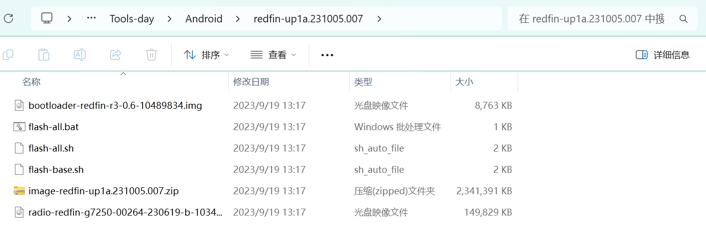

# Root 一台 Pixel 5 手机

## 下载手机的系统包

> Google 官方包：https://developers.google.com/android/images?hl=zh-cn

本测试手机是 Pixel 5(redfin) Android 14.0.0 (UP1A.231005.007, 2023 年 10 月) 的系统


下载完成后进行解压



## 在电脑上配置 adb 环境

> adb 说明：https://developer.android.com/tools/adb?hl=zh-cn

> SDK 下载：https://developer.android.com/tools/releases/platform-tools?hl=zh-cn

Android 调试桥 (adb - Android Debug Bridge) 是一种功能多样的命令行工具，可让您与设备进行通信。adb 命令可用于执行各种设备操作，例如安装和调试应用。adb 提供对 Unix shell（可用来在设备上运行各种命令）的访问权限。

下载完成后，将 `android_sdk/platform-tools/` 路径添加到系统环境变量中。之后便可以通过 USB 方式连接设备进行调试。

> **注意**：⚠️ 通过 USB 连接的设备上使用 adb，您必须在设备的系统设置中启用 USB 调试（位于开发者选项下）

使用 `adb version` 查看是否安装成功


## 安装 Google USB 驱动

> Google 官方地址：https://developer.android.com/studio/run/win-usb

下载驱动


进入 Windows 的 ⌊设备管理器⌉ 中会有一个 pixel 5 手机设备，鼠标右键选择 更新驱动 ，选择到下载驱动的目录

## 解锁 Bootloader

> **注意**：⚠️ 解锁 Bootloader 会让手机自动恢复出厂设置，在这之前请备份所有需要的资料

电脑上的 adb 环境配置完成后，我们还需要在手机上手动启用 adb 调试。在 Pixel 的设置 - 关于手机页面中，连续点击最下面的版本号七八次，直到下面的弹窗提示「您现在处于开发者模式！」，如果你的手机设置了密码的话，则需要输入密码确认后才能启用开发者模式。

此时，在设置 - 系统的页面中就多出来了一行开发者选项的入口。进入开发者选项后，我们需要做三件事：

- 打开 USB 调试开关
- 关闭系统自动更新开关
- 打开 OEM 解锁开关（如果这个开关处于关闭状态并且是灰色的，说明你的 Pixel 是有锁机器，是无法 root 的；但如果是灰色并处于打开位置的话，则 Bootloader 已经解锁，可以直接进入下一步下载系统镜像了）

这时如果我们再将 Pixel 连接到电脑上，手机就会弹出提示窗口询问我们是否允许来自电脑的 USB 调试，勾选「一律允许使用这台计算机进行调试」，点击允许即可。

使用 `adb devices` 查看是否连接成功


将手机重启到 Bootloader（BL）界面

```
adb reboot bootloader
```

查看进入到 Bootloader 界面后电脑是否能够正常检测到手机

```
fastboot devices
```

没有返回信息，则说明 Google USB 驱动有问题，需要安装或更新驱动


正常情况如下


输入命令，进行解锁 Bootloader

```
fastboot flashing unlock
```


cd 到下载好的系统包中


执行命令，进行刷机

```
flash-all.bat
```


显示 `Finished.` 等信息，并且手机也重启，说明刷机已完成

## 安装 Magisk

> Magisk Github 地址：https://github.com/topjohnwu/Magisk

使用 adb 安装 app

```
adb install xxx.apk
```

## 传输和修补镜像

进入下载好的系统包中，解压 images 压缩文件，里面会有 boot.img 文件


上传到手机默认的下载目录中

```
adb push xxx\Android\redfin-up1a.231005.007\image-redfin-up1a.231005.007\boot.img /storage/emulated/0/Download
```

打开 magisk app，进行镜像修补，magisk 会将处理好的新 boot 镜像同样保存在 Download 文件夹里


将修补好的镜像，拉取出来保存在 Windows 中

```
adb pull /storage/emulated/0/Download/magisk_patched-28100_89t0t.img D:\
```


## 使用修复的镜像再次刷机

```
adb reboot bootloader

fastboot devices

fastboot flash boot xxx\magisk_patched-28100_89t0t.img
```


刷机完成后，手机会自动重启，等到手机重新启动后，再次进入 magisk app 里我们刚刚修补镜像的界面，不同的是，这次这里多出了两个选项。选择「直接安装（推荐）」， magisk 就会自动完成剩下的工作：


magisk 板块内的「当前」就会从「无法读取」变成 Magisk app 的版本号，表明已经取得 root 权限，「超级用户」和「模块」功能也能够正常使用


## Magisk 模块

> LSP 框架：https://github.com/LSPosed/LSPosed

> shamiko 隐藏root：https://magiskcn.com/shamiko-install.html

> Android 14 证书安装：https://github.com/wjf0214/Magisk-MoveCACerts