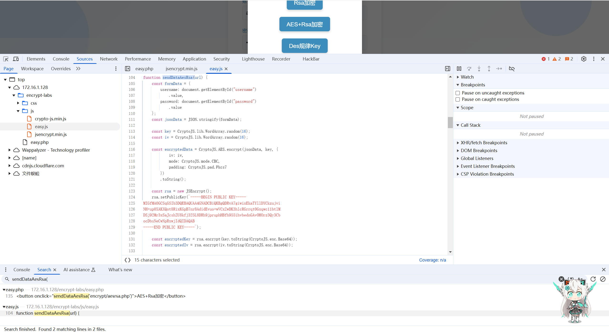
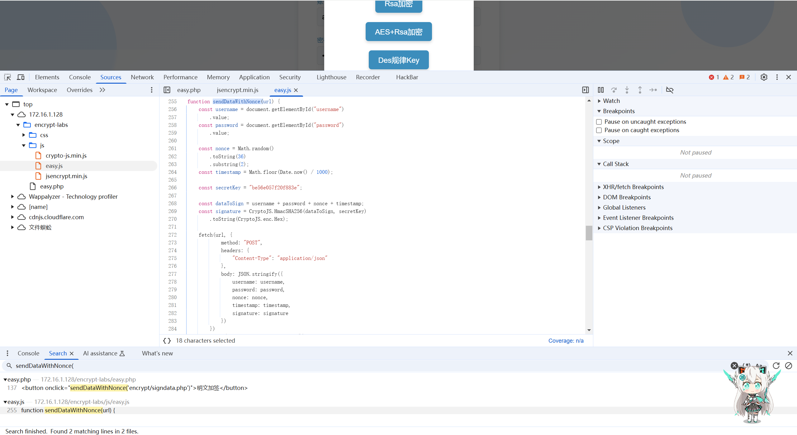
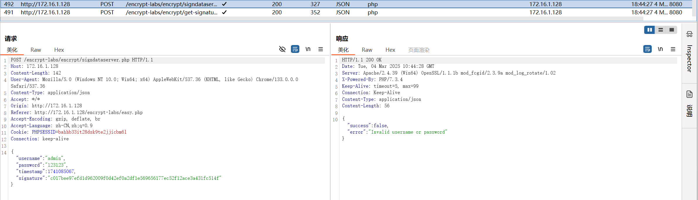

## 环境搭建:

> 项目地址：https://github.com/SwagXz/encrypt-labs/tree/main

nginx+mysql+php8 放在网站路径+导入数据库

Ta0ing 师傅提供了 docker 版本的

```
git clone https://github.com/Ta0ing/encrypt-labs-docker.git

docker-compose up -d --build
```

## 无混淆关卡

### 【第一关】AES 固定 key

抓包数据包发现加密，加密参数为 `encryptedData`


查看元素，发现点击事件，进行跟进 `sendDataAes('encrypt/aes.php')`


`CTRL + SHIFT + F` 全局搜索`sendDataAes(` 函数，进行定位


根据函数内容，可知

`AES`加密，`CBC`模式，`PKCS7Padding`

`key:1234567890123456` / `iv:1234567890123456`

python 算法还原

```python
'''
pip install pycryptodome
'''

from Crypto.Cipher import AES
from Crypto.Util.Padding import pad, unpad
import base64

# 定义密钥和初始向量
key = b'1234567890123456'  # 16字节密钥
iv = b'1234567890123456'  # 16字节初始向量

# 加密函数
def encrypt(plain_text):
    # 创建一个 AES cipher 对象，使用 CBC 模式
    cipher = AES.new(key, AES.MODE_CBC, iv)

    # 对明文进行 PKCS7 填充
    padded_data = pad(plain_text.encode(), AES.block_size)

    # 执行加密操作
    encrypted_data = cipher.encrypt(padded_data)

    # 返回加密后的数据（可以选择返回 Base64 编码的字符串方便存储）
    return base64.b64encode(encrypted_data).decode()

# 解密函数
def decrypt(encrypted_text):
    # 先将 Base64 编码的密文解码为字节串
    encrypted_data = base64.b64decode(encrypted_text)

    # 创建一个 AES cipher 对象，使用 CBC 模式
    cipher = AES.new(key, AES.MODE_CBC, iv)

    # 解密并去除 PKCS7 填充
    decrypted_data = unpad(cipher.decrypt(encrypted_data), AES.block_size)

    # 返回解密后的数据（解码为字符串）
    return decrypted_data.decode()

if __name__ == "__main__":
    # 测试数据
    plain_text = "{\"username\":\"admin\",\"password\":\"123456\"}"

    # 加密
    encrypted_text = encrypt(plain_text)
    print(f"Encrypted Text: {encrypted_text}")

    # 解密
    decrypted_text = decrypt(encrypted_text)
    print(f"Decrypted Text: {decrypted_text}")
```

### 【第二关】AES 服务端获取 Key

抓包数据包发现发送了两次请求，第一次请求用于获取 key 和 iv ，第二次进行发送加密数据包


同样查找元素事件，跟进函数


除开 key 和 iv ，其他 AES 加密参数并没有改变

经过重复发包测试，短期时间内 key 和 iv 不会改变，可以直接进行 base64 解密后，用第一关的加密函数，进行加密

python 算法还原

```python
from Crypto.Cipher import AES
from Crypto.Util.Padding import pad, unpad
import base64, requests

cookies = {
    'PHPSESSID': '9e8df6cab58aa34e5c833c852bb95f7a',
}

headers = {
    'Host': '172.16.1.128',
    'User-Agent': 'Mozilla/5.0 (Windows NT 10.0; Win64; x64) AppleWebKit/537.36 (KHTML, like Gecko) Chrome/131.0.0.0 Safari/537.36',
    'Accept': '*/*',
    'Referer': 'http://172.16.1.128/encrypt-labs/easy.php',
    # 'Accept-Encoding': 'gzip, deflate',
    'Accept-Language': 'zh-CN,zh;q=0.9',
    'Connection': 'close',
    # 'Cookie': 'PHPSESSID=9e8df6cab58aa34e5c833c852bb95f7a',
}

# 获取aes_key 和aes_iv
response = requests.get('http://172.16.1.128/encrypt/server_generate_key.php', cookies=cookies, headers=headers, verify=False)
response = response.json()
aes_key = base64.b64decode(response['aes_key'])
aes_iv = base64.b64decode(response['aes_iv'])

# 加密函数
def encrypt(plain_text):
    # 创建一个 AES cipher 对象，使用 CBC 模式
    cipher = AES.new(aes_key, AES.MODE_CBC, aes_iv)

    # 对明文进行 PKCS7 填充
    padded_data = pad(plain_text.encode(), AES.block_size)

    # 执行加密操作
    encrypted_data = cipher.encrypt(padded_data)

    # 返回加密后的数据（可以选择返回 Base64 编码的字符串方便存储）
    return base64.b64encode(encrypted_data).decode()

# 解密函数
def decrypt(encrypted_text):
    # 先将 Base64 编码的密文解码为字节串
    encrypted_data = base64.b64decode(encrypted_text)

    # 创建一个 AES cipher 对象，使用 CBC 模式
    cipher = AES.new(aes_key, AES.MODE_CBC, aes_iv)

    # 解密并去除 PKCS7 填充
    decrypted_data = unpad(cipher.decrypt(encrypted_data), AES.block_size)

    # 返回解密后的数据（解码为字符串）
    return decrypted_data.decode()

if __name__ == "__main__":
    # 测试数据
    plain_text = "{\"username\":\"admin\",\"password\":\"123456\"}"

    # 加密
    encrypted_text = encrypt(plain_text)
    print(f"Encrypted Text: {encrypted_text}")

    # 解密
    decrypted_text = decrypt(encrypted_text)
    print(f"Decrypted Text: {decrypted_text}")
```

### 【第三关】RSA 加密

抓包数据包，发现加密请求，加密参数 `data`


进行跟踪定位加密函数


根据函数内容，可知

`RSA` 加密，`publickey` 如下：

```
-----BEGIN PUBLIC KEY-----
MIGfMA0GCSqGSIb3DQEBAQUAA4GNADCBiQKBgQDRvA7giwinEkaTYllDYCkzujvi
NH+up0XAKXQot8RixKGpB7nr8AdidEvuo+wVCxZwDK3hlcRGrrqt0Gxqwc11btlM
DSj92Mr3xSaJcshZU8kfj325L8DRh9jpruphHBfh955ihvbednGAvOHOrz3Qy3Cb
ocDbsNeCwNpRxwjIdQIDAQAB
-----END PUBLIC KEY-----
```

RSA 加密需一个公钥，解密需要私钥，没有私钥，只能尝试加密

**注意**：base64 加密传输如果不成功，记得进行 url 转码

python 算法还原

```python
'''
pip install pycryptodome
'''

from Crypto.PublicKey import RSA
from Crypto.Cipher import PKCS1_v1_5
from base64 import b64encode, b64decode
import json
import requests
import urllib.parse

def rsa_encrypt(data, public_key):
    """
    RSA加密，Base64格式
    """
    key = RSA.import_key(public_key)
    cipher = PKCS1_v1_5.new(key)
    encrypted_data = cipher.encrypt(data.encode('utf-8'))
    return b64encode(encrypted_data).decode('utf-8')

def send_post(data):
    cookies = {
        'PHPSESSID': 'bahhb33it28dsk9te2jjicbm6l',
    }

    headers = {
        'Accept': '*/*',
        'Accept-Language': 'zh-CN,zh;q=0.9',
        'Connection': 'keep-alive',
        'Content-Type': 'application/x-www-form-urlencoded',
        'Origin': 'http://172.16.1.128',
        'Referer': 'http://172.16.1.128/encrypt-labs/easy.php',
        'User-Agent': 'Mozilla/5.0 (Windows NT 10.0; Win64; x64) AppleWebKit/537.36 (KHTML, like Gecko) Chrome/133.0.0.0 Safari/537.36',
        # 'Cookie': 'PHPSESSID=bahhb33it28dsk9te2jjicbm6l',
    }

    data = 'data={}'.format(data)

    response = requests.post(
        'http://172.16.1.128/encrypt-labs/encrypt/rsa.php',
        cookies=cookies,
        headers=headers,
        data=data,
        verify=False,
    )

    print(response.text)

if __name__ == '__main__':
    # 原始公钥（字符串）
    public_key = """-----BEGIN PUBLIC KEY-----
    MIGfMA0GCSqGSIb3DQEBAQUAA4GNADCBiQKBgQDRvA7giwinEkaTYllDYCkzujvi
    NH+up0XAKXQot8RixKGpB7nr8AdidEvuo+wVCxZwDK3hlcRGrrqt0Gxqwc11btlM
    DSj92Mr3xSaJcshZU8kfj325L8DRh9jpruphHBfh955ihvbednGAvOHOrz3Qy3Cb
    ocDbsNeCwNpRxwjIdQIDAQAB
    -----END PUBLIC KEY-----"""

    # 明文数据
    plaintext = {
        'username': 'admin',
        'password': '123456',
    }

    # 转换为 JSON 字符串
    data_string = json.dumps(plaintext)

    # 使用公钥加密数据
    print("Original Message: ", data_string)
    encrypted_message = rsa_encrypt(data_string, public_key)
    # **URL 编码加密后的数据**
    encrypted_message = urllib.parse.quote(encrypted_message)
    print("Encrypted Message (Base64): ", encrypted_message)

    send_post(encrypted_message)
```

### 【第四关】AES+RSA 加密

抓包数据包，发现加密请求，加密参数 `encryptedData`, `encryptedKey`, `encryptedIv`


进行跟踪定位加密函数



根据函数内容，可知

`AES` 加密的`key` 和`iv` 随机生成

`RSA` 加密，`publickey` 如下：

```
-----BEGIN PUBLIC KEY-----
MIGfMA0GCSqGSIb3DQEBAQUAA4GNADCBiQKBgQDRvA7giwinEkaTYllDYCkzujvi
NH+up0XAKXQot8RixKGpB7nr8AdidEvuo+wVCxZwDK3hlcRGrrqt0Gxqwc11btlM
DSj92Mr3xSaJcshZU8kfj325L8DRh9jpruphHBfh955ihvbednGAvOHOrz3Qy3Cb
ocDbsNeCwNpRxwjIdQIDAQAB
-----END PUBLIC KEY-----
```

这里是使用 AES 对表单数据进行加密，使用 RSA 对随机生成的 key 和 iv 进行加密，需要注意的是在 python 中进行算法还原时，需要考虑到不同方法返回的数据类型的不同

python 算法还原

```python
'''
pip install pycryptodome
'''

from Crypto.Cipher import AES, PKCS1_v1_5
from Crypto.PublicKey import RSA
from Crypto.Util.Padding import pad
from Crypto.Random import get_random_bytes
import base64
import json
import requests

# AES 加密
def aes_encrypt(plain_text, key, iv):
    cipher = AES.new(key, AES.MODE_CBC, iv)
    padded_data = pad(plain_text.encode(), AES.block_size)  # PKCS7 填充
    encrypted_data = cipher.encrypt(padded_data)
    return base64.b64encode(encrypted_data).decode()

# RSA 加密
def rsa_encrypt(data, public_key):
    key = RSA.import_key(public_key)
    cipher = PKCS1_v1_5.new(key)
    encrypted_data = cipher.encrypt(data)
    return base64.b64encode(encrypted_data).decode()

# 发送数据
def send_post(encryptedData, encryptedKey, encryptedIv):
    headers = {
        "Content-Type": "application/json"
    }
    json_data = {
        "encryptedData": encryptedData,
        "encryptedKey": encryptedKey,
        "encryptedIv": encryptedIv
    }
    response = requests.post("http://172.16.1.128/encrypt-labs/encrypt/aesrsa.php", headers=headers, json=json_data)
    print(response.text)

if __name__ == "__main__":
    # 公钥
    public_key = """-----BEGIN PUBLIC KEY-----
    MIGfMA0GCSqGSIb3DQEBAQUAA4GNADCBiQKBgQDRvA7giwinEkaTYllDYCkzujvi
    NH+up0XAKXQot8RixKGpB7nr8AdidEvuo+wVCxZwDK3hlcRGrrqt0Gxqwc11btlM
    DSj92Mr3xSaJcshZU8kfj325L8DRh9jpruphHBfh955ihvbednGAvOHOrz3Qy3Cb
    ocDbsNeCwNpRxwjIdQIDAQAB
    -----END PUBLIC KEY-----"""

    # 需要加密的明文数据
    plaintext = {
        "username": "admin",
        "password": "123456"
    }
    json_data = json.dumps(plaintext)  # 转换为 JSON 字符串

    # 生成 AES 密钥 & IV
    key = get_random_bytes(16)  # 16 字节密钥
    iv = get_random_bytes(16)  # 16 字节 IV

    # AES 加密数据
    encryptedData = aes_encrypt(json_data, key, iv)
    print(f"Encrypted Data: {encryptedData}")

    # RSA 加密 Key & IV（先 Base64，再加密）
    encryptedKey = rsa_encrypt(base64.b64encode(key), public_key)
    encryptedIv = rsa_encrypt(base64.b64encode(iv), public_key)

    print(f"Encrypted Key: {encryptedKey}")
    print(f"Encrypted IV: {encryptedIv}")

    # 发送加密数据
    send_post(encryptedData, encryptedKey, encryptedIv)
```

### 【第五关】DES 规律 key

抓包数据包，发现加密请求，加密参数 `password`


进行跟踪定位加密函数


根据函数内容，可知

`DES` 加密，`CBC`模式，`PKCS7Padding`

`key`是八位，`username`的前 8 位，不满 8 位，则用 6 补满

`iv`是八位，9999+username 的前四位，不满 8 位，则用 9 补满

python 算法还原

```python
from Crypto.Cipher import DES
from Crypto.Util.Padding import pad
from Crypto.Random import get_random_bytes
from Crypto.Util.Padding import unpad
import binascii

def des_encrypt(username, password):
    # 生成 DES 密钥，用户名前 8 字符，且不足 8 字符用 '6' 补齐
    key = (username[:8] + '6' * 8)[:8].encode('utf-8')

    # 生成 IV，用户名前 4 字符 + '9999'，且不足 8 字符用 '9' 补齐
    iv = ('9999' + username[:4] + '9' * 4)[:8].encode('utf-8')

    # 创建 DES cipher 对象，使用 CBC 模式
    cipher = DES.new(key, DES.MODE_CBC, iv)

    # 使用 PKCS7 填充密码
    padded_password = pad(password.encode('utf-8'), DES.block_size)

    # 执行加密
    encrypted_password = cipher.encrypt(padded_password)

    # 将加密后的密文转换为十六进制字符串
    encrypted_hex = binascii.hexlify(encrypted_password).decode('utf-8')

    return encrypted_hex

def des_decrypt(username, encrypted_hex):
    # 生成 DES 密钥，用户名前 8 字符，且不足 8 字符用 '6' 补齐
    key = (username[:8] + '6' * 8)[:8].encode('utf-8')

    # 生成 IV，用户名前 4 字符 + '9999'，且不足 8 字符用 '9' 补齐
    iv = ('9999' + username[:4] + '9' * 4)[:8].encode('utf-8')

    # 创建 DES cipher 对象，使用 CBC 模式
    cipher = DES.new(key, DES.MODE_CBC, iv)

    # 将十六进制的加密密文转换为字节
    encrypted_data = binascii.unhexlify(encrypted_hex)

    # 执行解密
    decrypted_data = cipher.decrypt(encrypted_data)

    # 去除 PKCS7 填充
    decrypted_password = unpad(decrypted_data, DES.block_size).decode('utf-8')

    return decrypted_password

if __name__ == "__main__":
    # 测试数据
    username = "admin"  # 示例用户名
    password = "123456"  # 示例密码

    # 加密
    encrypted_password = des_encrypt(username, password)
    print("Encrypted Password (Hex):", encrypted_password)

    # 解密
    decrypted_password = des_decrypt(username, encrypted_password)
    print("Decrypted Password:", decrypted_password)
```

### 【第六关】明文加签

抓包数据包，发现有签名参数 `signature`


进行跟踪定位加密函数



根据函数内容，可知

`HMAC-SHA256` 签名方法，`nonce` 参数为随机字符串， `timestamp` 参数为当前时间戳

加密密钥 `secret_key = be56e057f20f883e`

python 算法还原

```python
import hashlib
import hmac
import time
import random
import requests
import string

def generate_signature(username, password, secret_key):
    # 生成nonce（随机字符串）
    nonce = ''.join(random.choices(string.ascii_letters + string.digits, k=16))

    # 获取当前时间戳（秒）
    timestamp = int(time.time())

    # 构造待签名的数据
    data_to_sign = f"{username}{password}{nonce}{timestamp}"

    # 生成 HMAC-SHA256 签名
    signature = hmac.new(secret_key.encode('utf-8'), data_to_sign.encode('utf-8'), hashlib.sha256).hexdigest()

    return signature, nonce, timestamp

def send_post(username, password, signature, nonce, timestamp):
    cookies = {
        'PHPSESSID': '9e8df6cab58aa34e5c833c852bb95f7a',
    }

    headers = {
        'Accept': '*/*',
        'Accept-Language': 'zh-CN,zh;q=0.9',
        'Content-Type': 'application/json',
        'Origin': 'http://172.16.1.128',
        'Proxy-Connection': 'keep-alive',
        'Referer': 'http://172.16.1.128/encrypt-labs/easy.php',
        'User-Agent': 'Mozilla/5.0 (Windows NT 10.0; Win64; x64) AppleWebKit/537.36 (KHTML, like Gecko) Chrome/133.0.0.0 Safari/537.36',
        # 'Cookie': 'PHPSESSID=bahhb33it28dsk9te2jjicbm6l',
    }

    json_data = {
        'username': username,
        'password': password,
        'nonce': nonce,
        'timestamp': timestamp,
        'signature': signature,
    }

    response = requests.post(
        'http://172.16.1.128/encrypt-labs/encrypt/signdata.php',
        cookies=cookies,
        headers=headers,
        json=json_data,
        verify=False,
    )

    print(response.text)

if __name__ == "__main__":
    # 测试数据
    username = "admin"
    password = "123456"
    secret_key = "be56e057f20f883e"

    # 进行签名
    signature, nonce, timestamp = generate_signature(username, password, secret_key)

    print(f"Signature: {signature}")
    print(f"Nonce: {nonce}")
    print(f"Timestamp: {timestamp}")

    # 发送请求
    send_post(username, password, signature, nonce, timestamp)
```

### 【第七关】服务端加签

抓包数据包，发现发送了两次数据包，

第一次向服务器获取签名参数 `signature`


第二次发送数据包，进行身份验证



进行跟踪定位加密函数


根据函数内容，可知

`timestamp` 参数为当前时间戳

python 算法还原

```python
import hashlib
import hmac
import time
import random
import requests
import string

cookies = {
    'PHPSESSID': '9e8df6cab58aa34e5c833c852bb95f7a',
}

headers = {
    'Accept': '*/*',
    'Accept-Language': 'zh-CN,zh;q=0.9',
    'Content-Type': 'application/json',
    'Origin': 'http://172.16.1.128',
    'Proxy-Connection': 'keep-alive',
    'Referer': 'http://172.16.1.128/encrypt-labs/easy.php',
    'User-Agent': 'Mozilla/5.0 (Windows NT 10.0; Win64; x64) AppleWebKit/537.36 (KHTML, like Gecko) Chrome/133.0.0.0 Safari/537.36',
    # 'Cookie': 'PHPSESSID=bahhb33it28dsk9te2jjicbm6l',
}

def get_signature(username, password, timestamp):
    json_data = {
        'username': username,
        'password': password,
        'timestamp': timestamp,
    }

    response = requests.post(
        'http://172.16.1.128/encrypt-labs/encrypt/get-signature.php',
        cookies=cookies,
        headers=headers,
        json=json_data,
        verify=False,
    ).json()

    return response['signature']

def send_post(username, password, signature, timestamp):
    json_data = {
        'username': username,
        'password': password,
        'timestamp': timestamp,
        'signature': signature,
    }

    response = requests.post(
        'http://172.16.1.128/encrypt-labs/encrypt/signdataserver.php',
        cookies=cookies,
        headers=headers,
        json=json_data,
        verify=False,
    )

    print(response.text)

if __name__ == "__main__":
    # 测试数据
    username = "admin"
    password = "123456"
    # 获取当前时间戳（秒）
    timestamp = int(time.time())

    # 进行签名
    signature = get_signature(username, password, timestamp)

    print(f"Signature: {signature}")
    print(f"Timestamp: {timestamp}")

    # 发送请求
    send_post(username, password, signature, timestamp)
```

### 【第八关】禁止重放

抓包数据包，发现`random` 加密参数


再次进行重放时，服务端一直返回 No Repeater


进行跟踪定位加密函数，发现数据包`generateRequestData(` 函数中


再跟踪`generateRequestData(` 函数


根据函数内容，可知

`random` 参数为当前时间戳，再进行`rsa` 加密

python 算法还原

```python
from Crypto.PublicKey import RSA
from Crypto.Cipher import PKCS1_v1_5
from base64 import b64encode, b64decode
import time
import requests

def rsa_encrypt(data, public_key):
    """
    RSA加密，Base64格式
    """
    key = RSA.import_key(public_key)
    cipher = PKCS1_v1_5.new(key)
    encrypted_data = cipher.encrypt(data.encode('utf-8'))
    return b64encode(encrypted_data).decode('utf-8')

def sent_post(username, password, random):
    headers = {
        'Host': '172.16.1.128',
        # 'Content-Length': '224',
        'User-Agent': 'Mozilla/5.0 (Windows NT 10.0; Win64; x64) AppleWebKit/537.36 (KHTML, like Gecko) Chrome/133.0.0.0 Safari/537.36',
        'Content-Type': 'application/json; charset=utf-8',
        'Accept': '*/*',
        'Origin': 'http://172.16.1.128',
        'Referer': 'http://172.16.1.128/encrypt-labs/easy.php',
        # 'Accept-Encoding': 'gzip, deflate, br',
        'Accept-Language': 'zh-CN,zh;q=0.9',
        'Connection': 'keep-alive',
    }

    json_data = {
        'username': username,
        'password': password,
        'random': random,
    }

    response = requests.post('http://172.16.1.128/encrypt-labs/encrypt/norepeater.php', headers=headers, json=json_data,
                             verify=False)

    print(response.text)

if __name__ == '__main__':
    # 原始公钥（字符串）
    public_key = """-----BEGIN PUBLIC KEY-----
    MIGfMA0GCSqGSIb3DQEBAQUAA4GNADCBiQKBgQDRvA7giwinEkaTYllDYCkzujvi
    NH+up0XAKXQot8RixKGpB7nr8AdidEvuo+wVCxZwDK3hlcRGrrqt0Gxqwc11btlM
    DSj92Mr3xSaJcshZU8kfj325L8DRh9jpruphHBfh955ihvbednGAvOHOrz3Qy3Cb
    ocDbsNeCwNpRxwjIdQIDAQAB
    -----END PUBLIC KEY-----"""

    # 明文数据
    username = 'admin'
    password = '123456'

    # 获取当前时间戳（秒）
    timestamp = int(time.time() * 1000)  # 毫秒级时间戳（匹配 JS `Date.now()`）

    random = rsa_encrypt(str(timestamp), public_key)

    sent_post(username, password, random)
```
